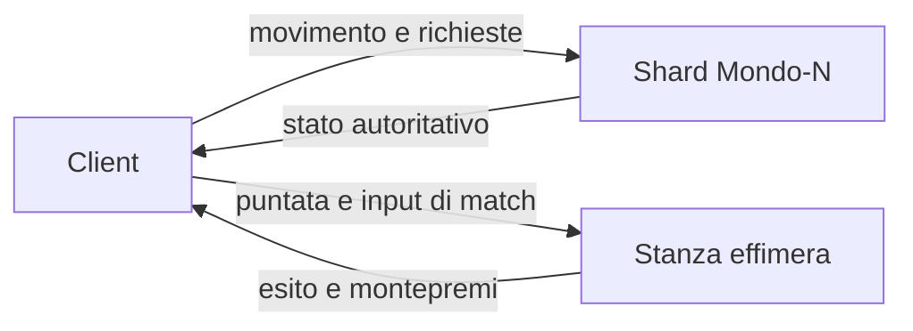

# Minimondo

**Apri sul telefono:** [https://represent-gaps-that-van.trycloudflare.com/](https://represent-gaps-that-van.trycloudflare.com/)

È la build di produzione, servita da un tunnel Cloudflare perché l’API di questo ambiente non può accendere GitHub Pages (403 su `POST /pages`, e il workflow di deploy risponde 404 finché Pages non è abilitato). Il ramo `gh-pages` è già pronto: in Settings → Pages → Deploy from a branch → `gh-pages` / `/` il sito stabile diventa [https://carbonettosimone-source.github.io/Citta/](https://carbonettosimone-source.github.io/Citta/). Il tunnel non ha garanzia di uptime: se il link non risponde, quel passo in Settings lo rimpiazza.

Hub nel browser, pensato per il pollice: un pianeta sferico di raggio 160 m, dieci volte il giro del guscio precedente. La gravità tira verso il centro, l’orizzonte curva, e sei spicchi grandi si incontrano su cuciture scure. Raccogli le sfide sparse negli spicchi, poi entra nella demo di Ostacoli sulle dune. Doppio salto da terra e in aria. Le monete restano nel gioco. Niente cashout, niente soldi veri. IP originale: niente personaggi, testi o asset di altri franchise.

English: mobile-first spherical hub, radius 160. Six large wedge biomes, invented plants, slender avatar, double jump, touch stick, one finishable obstacle demo. Coins are a session stub. `npm install && npm run dev`.

## Come si gioca

Si parte in piazza, di fronte al faro. Il faro vale 20 monete: bastano per la demo.

- **Pollice sinistro** sulla levetta per camminare. A fondo corsa: la scritta diventa «corri».
- **Dito sul mondo** per girare la visuale. Il blocco del puntatore non serve.
- **Salta** è il tasto tondo a destra. Un secondo tocco in aria fa il doppio salto.
- Il pulsante al centro raccoglie la sfida quando sei vicino. Le monete sul sentiero si prendono da sole.
- **Mappa** mostra il pianeta, i paesi e dove guardi. Tocca un nome per la distanza.
- **Giochi** → scegli il modo → vedi la puntata → **Entra (demo)**. La bacheca in città apre lo stesso pannello.

Tastiera, se c'è: WASD o frecce camminano, Shift corre, trascina per guardare, E raccoglie, spazio salta, M apre la mappa, Q e R ruotano.

Portrait e landscape usano gli stessi controlli. I pannelli rispettano le safe area.

## La demo Ostacoli

Quattro corridori, puntata 20, tutto in questa sessione del browser. La puntata esce solo al «via»: se abbandoni il conto alla rovescia non perdi nulla. Dopo il via, abbandonare o sforare i 24 secondi è un quarto posto.

Il montepremi di quattro puntate torna ai corridori, senza rake:

| Posto | Incasso su 20 |
| --- | --- |
| 1° | 48 |
| 2° | 24 |
| 3° | 8 |
| 4° | 0 |

Rami, Lea e Nico sono tempi fissi. Una linea pulita può arrivare prima di Rami; una corsa lenta prende il terzo. Il rango settimanale di questa sessione parte vuoto e migliora (il numero scende) quando chiudi una gara. Poi **Torna in piazza**.

Corsa, Logica, Precisione e il Giro degli spicchi mostrano la scheda ma non aprono una stanza. Il giro paga 25 monete da solo, quando hai visitato le sei mete. Nessuna puntata, niente soldi veri.

Il cerchio ciano in fondo al percorso sblocca anche il cancello, se lo raggiungi fuori dalla gara.

`grant`, `trySpend` e `applyMatchResult` in `src/game/session.ts` sono lo stub. Un server futuro manda lo stesso riepilogo e il client smette di decidere il portafoglio.

## Avvio in locale

```bash
npm install
npm run dev
```

Vite stampa un indirizzo (di solito `http://localhost:5173`). Build di produzione: `npm run build`, poi `npm run preview` (di solito `http://localhost:4173`).

La base degli asset è `/` in locale e nel tunnel. Il sito GitHub Pages usa `VITE_BASE=/Citta/` (`npm run build:pages`).

## Cosa c'è in questa versione

- Mini-pianeta di raggio 160. Si cammina sul guscio: il passo è nel piano tangente, la gravità è radiale, la camera tiene l’alto verso il centro. Un giro è circa un chilometro
- Sei spicchi larghi, con cucitura scura: mesa corallo, prateria menta, giardino viola, campo di cristalli, dune pesca, bosco di lanterne. Ogni spicchio ha un totem e la sua famiglia di piante
- Piante inventate (ventagli, dischi esagonali, stelle su stelo, torri di petali, cristalli, nastri, lanterne). Niente pini, querce o palme. Quasi tutte in `InstancedMesh`
- Palo-faro sul polo nord, sentiero chiaro, sfide lontane dallo spawn e colorate come il proprio spicchio
- Avatar snello, circa un quinto dell’altezza precedente. Passo e corsa sono animazioni diverse: la corsa piega il busto, allunga il passo e stende il mantello. Doppio salto
- Strade e piazze scavate nel guscio, con un rilievo basso fuori dal selciato. Cuciture sfumate fra gli spicchi. Stesso seme `hashText('Mondo-1')`
- Città del polo (piazza, strade, case con porte e finestre, torri con lanterne, bacheca dei giochi), paesi in menta, viola, cristallo e lanterne, campo ostacoli con un arco. Stesso seme a ogni caricamento
- Tappeto di flora inventata, boschetti, vento leggero sulle istanze. Rocce ferme. Tutto in `InstancedMesh` dove si ripete
- Mappa del pianeta dal HUD, con i luoghi e la direzione in cui guardi
- Monete lungo i sentieri, mete nei paesi, giro degli spicchi da 25, bacheca che apre Giochi
- Mondo rigenerato da seme (`hash32`, niente `Math.random`)
- WebGL2: scena a metà risoluzione, upscale nearest
- Nebbia corta, stesso colore del cielo
- Toon a quattro fasce, niente PBR. Gemme e segnali piatti, così restano leggibili nella nebbia
- Faro, anello, petali, belvedere e cancello: sagome diverse, ricompense diverse
- HUD: monete, Mondo-1, rango di sessione, toast, Mappa, Giochi, levetta (corri a fondo) e Salta
- Mini-gara ostacoli sulle dune, completabile, con avversari finti e saldo monete

## Architettura prevista

Il client disegna e manda l'intenzione. Non deve restare l'autorità su monete, punteggi e puntate: oggi lo è solo perché non c'è ancora un socket.



**Shard.** Ogni mondo è un clone, funzione di `(seme, chunk)`. Quando uno shard è pieno se ne apre un altro, stesso contenuto, altro id. `PROTO` in `src/game/content.ts` va alzato se il layout cambia.

**Stanze.** In produzione un evento non vive nell'hub: il server apre una room, incassa la puntata, simula, paga, chiude. La demo Ostacoli è la stessa regola, risolta in locale da `src/game/match.ts`.

**Monete.** Conto interno di sessione. Il rango settimanale qui è un segnaposto. Nessun cashout.

Il vecchio prototipo teneva sul filo solo i giocatori e separava la simulazione dal disegno. Quel confine resta il modello.

## Dal prototipo precedente

`mondo-vivo.html` era una città deterministica in un solo file. Da lì restano, riscritte in piccolo: hash e seme, prop in `InstancedMesh`, nebbia uguale al cielo, camera con costante di tempo, input fuori dal render, e l'idea che «server pieno» sia un altro shard.

Non è stato portato il resto: griglia infinita, lockstep, pacchetti binari, vista ASCII, scheletri, ciclo del giorno.

## Layout

```
src/
  main.ts                 loop
  game/content.ts         sfide, eventi, percorso, PROTO
  game/session.ts         stub di portafoglio e saldo gara
  game/challenges.ts      segnaposto
  game/match.ts           demo ostacoli
  input/controls.ts       levetta, salto, trascinamento
  player/player.ts
  render/                 metà risoluzione, toon, cielo
  world/                  pianeta, biomi, collisione, hash
  ui/hud.ts
```

## Backlog

- Server autoritativo al posto di `session.ts`
- Handshake su `PROTO`
- Gestore di shard e classifica vera per mondo
- Room vere per Corsa, Logica e Precisione
- Predizione del movimento
- Privilegi settimanali dal rango vero
- Account

Fuori scope anche dopo: soldi veri, NFT, Nanite, WebGPU obbligatorio, post-processing pesante.
