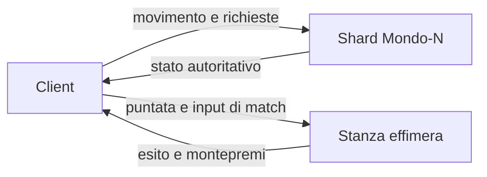

# Minimondo

Hub di gioco nel browser: un mondo piccolo, chiaro, low-poly, da esplorare a piedi per raccogliere monete. Gli eventi competitivi — gare, logica, precisione, ostacoli, da 20 a 100 giocatori — sono solo l'anteprima. Le monete restano nel gioco: niente cashout.

English: a walkable local hub prototype. `npm install && npm run dev`. Coins, challenge markers, and the Events panel are stubs. The client is deliberately dumb; a future server owns wagers, match rooms, and per-shard leaderboards.

## Avvio

```bash
npm install
npm run dev
```

Vite stampa un indirizzo locale (di solito `http://localhost:5173`). Per la build di produzione: `npm run build` e `npm run preview`.

Controlli:

- **WASD** o frecce per camminare
- **trascina** il mouse per guardare, oppure **Sguardo** per bloccare il puntatore (Esc per lasciarlo)
- **Q / R** ruotano la visuale
- **E** o il pulsante in basso per interagire
- **spazio** per saltare
- **Eventi** apre l'anteprima delle stanze

Si parte sul sentiero sud, di fronte al faro. A sud-est c'è un corridoio di barriere: è una prova locale, non un match.

## Cosa c'è in questa versione

- Isola-hub a tasselli (chunk da 8 m solo come tinta dell'erba, non un motore voxel)
- Mondo rigenerato da seme (`hash32`, niente `Math.random`)
- Pipeline WebGL2: scena a metà risoluzione, poi upscale nearest sul canvas
- Nebbia corta, colore allineato al cielo
- Materiali toon (`MeshToonMaterial`) e unlit piatti per gemme e anelli. Niente PBR
- Alberi, rocce, barriere e segnaposto in `InstancedMesh`
- Cinque sfide che versano monete finte e un toast
- HUD: monete, id **Mondo-1**, rango settimanale vuoto, pannello Eventi
- Corridoio ostacoli in singolo. Il match vero è nel backlog

## Architettura prevista

Il client disegna e manda l'intenzione (direzione, salto, interazione). Non decide monete, punteggi, puntate o chi vince.



**Shard.** Ogni mondo è un clone identico, funzione pura di `(seme, chunk)`. Mondo-1 e Mondo-2 hanno gli stessi alberi e le stesse sfide, e classifiche diverse. Quando uno shard è pieno se ne apre un altro: stesso contenuto, altro id. La geometria non si streama. `PROTO` in `src/game/content.ts` va alzato se il layout cambia, così un client vecchio viene rifiutato invece di divergere.

**Stanze effimere.** Un evento non gira dentro l'hub. Il server apre una room (corsa, logica, precisione, ostacoli; 20–100 giocatori), incassa la puntata in monete, simula la prova, paga il montepremi, chiude la room. Il corridoio a est è solo un assaggio in locale.

**Monete.** Conto interno. I privilegi settimanali escono dalla classifica dello shard. Nessun cashout, nessun oggetto fuori dal gioco.

Il vecchio prototipo separava già la simulazione dal disegno e teneva sul filo solo i giocatori. Quel confine resta il modello: predizione locale sul movimento, riconciliazione dal server, interesse limitato a chi è vicino. Non è implementato qui.

## Dal prototipo precedente

`mondo-vivo.html` era una città deterministica in un solo file. Da lì restano, riscritte in piccolo:

- hash intero e mondo funzione del seme
- prop ripetuti in `InstancedMesh`, ricostruiti una volta e non a ogni frame
- nebbia e cielo dello stesso colore, cupola con colori nei vertici
- camera che insegue con costante di tempo (`1 - e^(-dt·k)`), non con uno smorzamento legato al frame
- input tenuto fuori dal render: il tasto non è la posizione
- l'idea che «server pieno» significhi un altro shard, non un rifiuto secco

Non è stato portato il resto: griglia stradale infinita, lockstep a 20 Hz, pacchetti binari, vista ASCII, scheletri, ciclo del giorno. Era un'altra scena, e un file solo non regge il passo successivo.

## Layout

```
src/
  main.ts                 loop
  game/content.ts         sfide, eventi, Mondo-1, PROTO
  game/session.ts         monete locali di questa sessione
  game/challenges.ts      segnaposto e raccolta
  player/player.ts        cammino, sguardo, salto
  render/pipeline.ts      target a metà risoluzione e upscale
  render/toon.ts          fascia toon
  render/sky.ts           cupola
  world/hash.ts           hash32
  world/hub.ts            isola, alberi, rocce, corridoio
  world/collide.ts
  ui/hud.ts
```

## Backlog

- Server autoritativo per monete, esiti e puntate
- Handshake su `PROTO` e firma del seme
- Gestore di shard: capienza, clone identico, classifica per mondo
- Room effimere per i quattro modi, con chiusura a fine evento
- Predizione del movimento e riconciliazione
- Privilegi settimanali dal rango vero
- Touch, sul modello del joystick del prototipo vecchio
- Ostacoli come match, non come corridoio locale
- Persistenza dell'account

Fuori scope anche dopo: soldi veri, NFT, Nanite, WebGPU obbligatorio, post-processing pesante.
