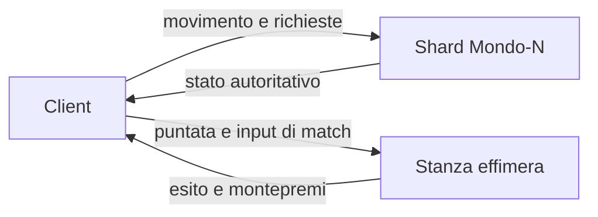

# Minimondo

**Apri sul telefono:** [https://leo-contacting-lecture-fantastic.trycloudflare.com/](https://leo-contacting-lecture-fantastic.trycloudflare.com/)

È la build di produzione, servita da un tunnel Cloudflare perché l’API di questo ambiente non può accendere GitHub Pages (403 su `POST /pages`, e il workflow di deploy risponde 404 finché Pages non è abilitato). Il ramo `gh-pages` è già pronto: in Settings → Pages → Deploy from a branch → `gh-pages` / `/` il sito stabile diventa [https://carbonettosimone-source.github.io/Citta/](https://carbonettosimone-source.github.io/Citta/). Il tunnel non ha garanzia di uptime: se il link non risponde, quel passo in Settings lo rimpiazza.

Hub nel browser, pensato per il pollice: un mondo piccolo, piatto, low-poly, da girare a piedi. Raccogli le sfide, poi entra nella demo di Ostacoli. Le monete restano nel gioco. Niente cashout, niente soldi veri.

English: mobile-first local hub. Touch stick, drag to look, one finishable obstacle demo. Coins are a session stub. `npm install && npm run dev`.

## Come si gioca

Si parte in piazza, di fronte al faro. Il faro vale 20 monete: bastano per la demo.

- **Pollice sinistro** sulla levetta per camminare. In alto si va avanti.
- **Dito sul mondo** per girare la visuale. Il blocco del puntatore non serve.
- **Salta** è il tasto tondo a destra.
- Il pulsante al centro raccoglie la sfida quando sei vicino.
- **Eventi** → scegli il modo → vedi la puntata → **Entra (demo)**.

Tastiera, se c'è: WASD o frecce, trascina per guardare, E raccoglie, spazio salta, Q e R ruotano.

Portrait e landscape usano gli stessi controlli. I pannelli rispettano le safe area.

## La demo Ostacoli

Quattro corridori, puntata 20, tutto in questa sessione del browser. La puntata esce solo al «via»: se abbandoni il conto alla rovescia non perdi nulla. Dopo il via, abbandonare o sforare i 24 secondi è un quarto posto.

Il montepremi di quattro puntate torna ai corridori, senza rake:

| Posto | Incasso su 20 |
| --- | --- |
| 1° | 48 |
| 2° | 24 |
| 3° | 8 |
| 4° | 0 |

Rami, Lea e Nico sono tempi fissi. Una linea pulita può arrivare prima di Rami; una corsa lenta prende il terzo. Il rango settimanale di questa sessione parte vuoto e migliora (il numero scende) quando chiudi una gara. Poi **Torna in piazza**.

Corsa, Logica e Precisione mostrano la puntata ma non aprono una stanza: un toast lo dice, e non scala monete.

Il cerchio ciano in fondo al percorso sblocca anche il cancello, se lo raggiungi fuori dalla gara.

`grant`, `trySpend` e `applyMatchResult` in `src/game/session.ts` sono lo stub. Un server futuro manda lo stesso riepilogo e il client smette di decidere il portafoglio.

## Avvio in locale

```bash
npm install
npm run dev
```

Vite stampa un indirizzo (di solito `http://localhost:5173`). Build: `npm run build`. Anteprima della build: `npm run preview`.

La base degli asset è `/` in locale. Il sito GitHub Pages usa `VITE_BASE=/Citta/` (`npm run build:pages`).

## Cosa c'è in questa versione

- Isola-hub a tasselli. I chunk da 8 m sono solo la tinta dell'erba, non un motore voxel
- Mondo rigenerato da seme (`hash32`, niente `Math.random`)
- WebGL2: scena a metà risoluzione, upscale nearest
- Nebbia corta, stesso colore del cielo
- Toon a quattro fasce, niente PBR. Gemme e segnali piatti, così restano leggibili nella nebbia
- Alberi, rocce, barriere e frecce in `InstancedMesh`
- Faro, anello, pietre, belvedere e cancello: sagome diverse, ricompense diverse
- Arco in piazza come punto di riferimento
- HUD: monete, Mondo-1, rango di sessione, toast, Eventi
- Mini-gara ostacoli completabile, con avversari finti e saldo monete

## Architettura prevista

Il client disegna e manda l'intenzione. Non deve restare l'autorità su monete, punteggi e puntate: oggi lo è solo perché non c'è ancora un socket.



**Shard.** Ogni mondo è un clone, funzione di `(seme, chunk)`. Quando uno shard è pieno se ne apre un altro, stesso contenuto, altro id. `PROTO` in `src/game/content.ts` va alzato se il layout cambia.

**Stanze.** In produzione un evento non vive nell'hub: il server apre una room, incassa la puntata, simula, paga, chiude. La demo Ostacoli è la stessa regola, risolta in locale da `src/game/match.ts`.

**Monete.** Conto interno di sessione. Il rango settimanale qui è un segnaposto. Nessun cashout.

Il vecchio prototipo teneva sul filo solo i giocatori e separava la simulazione dal disegno. Quel confine resta il modello.

## Dal prototipo precedente

`mondo-vivo.html` era una città deterministica in un solo file. Da lì restano, riscritte in piccolo: hash e seme, prop in `InstancedMesh`, nebbia uguale al cielo, camera con costante di tempo, input fuori dal render, e l'idea che «server pieno» sia un altro shard.

Non è stato portato il resto: griglia infinita, lockstep, pacchetti binari, vista ASCII, scheletri, ciclo del giorno.

## Layout

```
src/
  main.ts                 loop
  game/content.ts         sfide, eventi, percorso, PROTO
  game/session.ts         stub di portafoglio e saldo gara
  game/challenges.ts      segnaposto
  game/match.ts           demo ostacoli
  input/controls.ts       levetta, salto, trascinamento
  player/player.ts
  render/                 metà risoluzione, toon, cielo
  world/                  isola, collisione, hash
  ui/hud.ts
```

## Backlog

- Server autoritativo al posto di `session.ts`
- Handshake su `PROTO`
- Gestore di shard e classifica vera per mondo
- Room vere per Corsa, Logica e Precisione
- Predizione del movimento
- Privilegi settimanali dal rango vero
- Account

Fuori scope anche dopo: soldi veri, NFT, Nanite, WebGPU obbligatorio, post-processing pesante.
