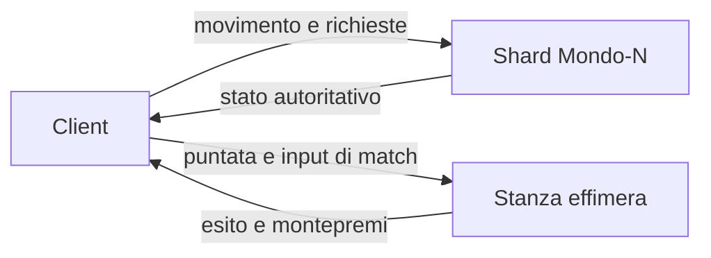

# Minimondo

Hub nel browser, pensato per il pollice: un pianeta sferico di raggio 160 m. La gravità tira verso il centro e l’orizzonte curva. Il hub è un indice sul guscio, non una città: raggio utile 28 m intorno a un centro seminato, nastro di flusso, bacheca, terminale, un piano di lettura e una sola uscita verso Paese A. Il faro resta al polo, fuori da quell’impronta. La regola è in [HUB.md](HUB.md).

La mappa è il globo: si trascina e si tocca Hub, Faro, Exit, o un punto qualsiasi del guscio. In alto compare una freccia d’oro che, ogni frame, indica l’arco più corto verso quella meta, con i metri. La × o Esc la toglie; sotto i 6 m sparisce da sola. L’anello a terra resta sul punto.

Si parte sul nastro, di fronte alla bacheca e all’uscita. Il faro vale 20 monete: bastano per la demo di Ostacoli. Doppio salto da terra e in aria. Le monete restano nel gioco. Niente cashout, niente soldi veri. IP originale: niente personaggi, testi o asset di altri franchise.

Anteprima telefono (tunnel Cloudflare sulla build di produzione, senza garanzia di uptime): [https://buyer-anaheim-anyway-publishers.trycloudflare.com](https://buyer-anaheim-anyway-publishers.trycloudflare.com). Il workflow `.github/workflows/pages.yml` pubblica il ramo `cursor/minimondo-hub-3bad` su GitHub Pages quando Pages è abilitato: [https://carbonettosimone-source.github.io/Citta/](https://carbonettosimone-source.github.io/Citta/).

English: mobile-first spherical hub, radius 160. One seeded hub, not six village wedges. Slender avatar, double jump, touch stick, one finishable obstacle demo. Coins are a session stub. `npm install && npm run dev`.

## Come si gioca

Si parte sul nastro dell’hub. Davanti: la traccia ciano verso la bacheca, e il nastro d’oro verso l’uscita. Il faro vale 20 monete: bastano per la demo.

- **Pollice sinistro** sulla levetta per camminare. A fondo corsa: la scritta diventa «corri».
- **Dito sul mondo** per girare la visuale. Il blocco del puntatore non serve.
- **Salta** è il tasto tondo a destra. Un secondo tocco in aria fa il doppio salto.
- **Vola** accende la modalità automobile sullo stesso personaggio: più veloce, sterza con la levetta, non vola via dal guscio. Un altro tocco torna al passo.
- Il pulsante al centro raccoglie la sfida quando sei vicino. Le monete sul sentiero si prendono da sole.
- **Mappa** è il globo. Trascinalo per girarlo. Tocca un luogo, un punto del guscio, o un nome nella lista: la mappa si chiude, ti volti, e la freccia in alto segue l’arco più corto. L’anello segna il punto a terra.
- **Giochi** → scegli il modo → vedi la puntata → **Entra (demo)**. La bacheca sull’hub apre lo stesso pannello.

Le tre quote, senza aprire la mappa: dall’anello di spawn segui la traccia ciano fino alla bacheca (meno di un quarto di minuto a passo); il nastro d’oro continua fino al cerchio Exit (meno di venti secondi); la rampa a ovest sale al piano Q2, da cui si vedono il faro a nord e la punta del piano verso l’uscita.

Tastiera, se c'è: WASD o frecce camminano, Shift corre, V è Vola, trascina per guardare anche mentre cammini, E raccoglie, spazio salta, M apre la mappa, Q e R ruotano.

Portrait e landscape usano gli stessi controlli. I pannelli rispettano le safe area.

## La demo Ostacoli

Quattro corridori, puntata 20, tutto in questa sessione del browser. La puntata esce solo al «via»: se abbandoni il conto alla rovescia non perdi nulla. Dopo il via, abbandonare o sforare i 24 secondi è un quarto posto.

Il montepremi di quattro puntate torna ai corridori, senza rake:

| Posto | Incasso su 20 |
| --- | --- |
| 1° | 48 |
| 2° | 24 |
| 3° | 8 |
| 4° | 0 |

Rami, Lea e Nico sono tempi fissi. Una linea pulita può arrivare prima di Rami; una corsa lenta prende il terzo. Il rango settimanale di questa sessione parte vuoto e migliora (il numero scende) quando chiudi una gara. Poi **Torna all'hub**.

Corsa, Logica, Precisione e il Giro mostrano la scheda ma non aprono una stanza. Il giro paga 25 monete da solo, quando hai visitato Faro, la bacheca e il terminale. Nessuna puntata, niente soldi veri.

Il cerchio ciano in fondo al percorso segna il traguardo della demo, lontano dall’hub.

`grant`, `trySpend` e `applyMatchResult` in `src/game/session.ts` sono lo stub. Un server futuro manda lo stesso riepilogo e il client smette di decidere il portafoglio.

## Avvio in locale

```bash
npm install
npm run dev
```

Vite stampa un indirizzo (di solito `http://localhost:5173`). Build di produzione: `npm run build`, poi `npm run preview` (di solito `http://localhost:4173`).

La base degli asset è `/` in locale e nel tunnel. Il sito GitHub Pages usa `VITE_BASE=/Citta/` (`npm run build:pages`).

## Cosa c'è in questa versione

- Mini-pianeta di raggio 160. Si cammina sul guscio: il passo è nel piano tangente, la gravità è radiale, la camera tiene l’alto verso il centro. Un giro è circa un chilometro
- Hub a intensità (vedi `HUB.md`): nucleo, moduli, bordo, una uscita. Filler strani più modelli Kenney CC0 (alberi, sassi, funghi: `ASSETS.md`, `STRUCTURES.md`). Stesso seme `hashText('Mondo-1')`
- Palo-faro sul polo nord, fuori dai 28 m dell’hub. Piattaforma Q2 per leggerlo insieme alla direzione dell’uscita
- Avatar snello. Passo e corsa sono animazioni diverse: la corsa piega il busto, allunga il passo e stende il mantello. Doppio salto
- Nastro e rampe sono la stessa funzione dei piedi (`shellLift`). Fuori dall’hub, rilievo basso e poco dressing. Niente spicchi
- Mappa dal HUD: globo 3D trascinabile, Hub, Faro, Exit, marcatore del giocatore, tocco che orienta il passo
- Monete sul nastro, faro, terminale, giro da 25, bacheca che apre Giochi
- Mondo rigenerato da seme (`hash32`, niente `Math.random`)
- WebGL2: scena a metà risoluzione, upscale nearest
- Nebbia corta, stesso colore del cielo
- Toon a quattro fasce, niente PBR. Gemme e segnali piatti, così restano leggibili nella nebbia
- Faro, bacheca e terminale: sagome diverse, ricompense diverse. Niente villaggi clonati
- HUD: monete, Mondo-1, rango di sessione, toast, Mappa, Giochi, levetta (corri a fondo) e Salta
- Mini-gara ostacoli sulle dune, completabile, con avversari finti e saldo monete

## Architettura prevista

Il client disegna e manda l'intenzione. Non deve restare l'autorità su monete, punteggi e puntate: oggi lo è solo perché non c'è ancora un socket.



**Shard.** Ogni mondo è un clone, funzione di `(seme, chunk)`. Quando uno shard è pieno se ne apre un altro, stesso contenuto, altro id. `PROTO` in `src/game/content.ts` va alzato se il layout cambia.

**Stanze.** In produzione un evento non vive nell'hub: il server apre una room, incassa la puntata, simula, paga, chiude. La demo Ostacoli è la stessa regola, risolta in locale da `src/game/match.ts`.

**Monete.** Conto interno di sessione. Il rango settimanale qui è un segnaposto. Nessun cashout.

Il vecchio prototipo teneva sul filo solo i giocatori e separava la simulazione dal disegno. Quel confine resta il modello.

## Dal prototipo precedente

`mondo-vivo.html` era una città deterministica in un solo file. Da lì restano, riscritte in piccolo: hash e seme, prop in `InstancedMesh`, nebbia uguale al cielo, camera con costante di tempo, input fuori dal render, e l'idea che «server pieno» sia un altro shard.

Non è stato portato il resto: griglia infinita, lockstep, pacchetti binari, vista ASCII, scheletri, ciclo del giorno.

## Layout

```
src/
  main.ts                 loop
  game/content.ts         sfide, eventi, percorso, PROTO
  game/session.ts         stub di portafoglio e saldo gara
  game/challenges.ts      segnaposto
  game/match.ts           demo ostacoli
  input/controls.ts       levetta, salto, trascinamento
  player/player.ts
  render/                 metà risoluzione, toon, cielo
  world/                  pianeta, biomi, collisione, hash
  ui/hud.ts
```

## Backlog

- Server autoritativo al posto di `session.ts`
- Handshake su `PROTO`
- Gestore di shard e classifica vera per mondo
- Room vere per Corsa, Logica e Precisione
- Predizione del movimento
- Privilegi settimanali dal rango vero
- Account

Fuori scope anche dopo: soldi veri, NFT, Nanite, WebGPU obbligatorio, post-processing pesante.
